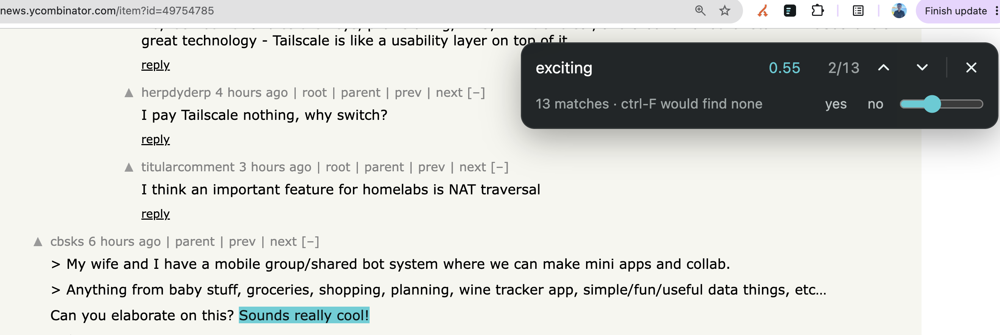

# Jev Find

Ctrl-F for meaning, powered by [TypeSafe](https://typesafe.ai). Jev scores each sentence against your query and highlights matches by probability. It only points to the author's words; it never generates text for you to read.

Search for paraphrases (`can I get my money back`), intent (`where does the author admit a mistake`), or properties (`commitments with a date attached`). Dotted underlines show literal matches for comparison.

## Install

1. Open `chrome://extensions`, enable Developer mode, and choose **Load unpacked** → this folder.
2. Open the extension's **Settings** (toolbar icon → Settings, or right-click → Options), paste your [TypeSafe](https://typesafe.ai) API key, and save.
3. Open `test/sample.html`, press `Ctrl/Cmd+Shift+F`, and try a query above.

Change the shortcut at `chrome://extensions/shortcuts` if needed.

## Usage

- Search runs after 650 ms of idle typing. Selected page text becomes the initial query.
- **Enter / Shift+Enter** moves to the next / previous match; **Esc** closes.
- Highlight intensity reflects probability: solid at 0.72+, faint down to the threshold. The current match's probability appears beside the count.
- Adjust the threshold slider (default 0.45) to repaint instantly without new requests.
- Dotted underlines mark literal matches; the status line compares literal and semantic counts.
- Click **yes / no** to label the current match and advance. Labels stay in local storage; export them from Settings as `labels.json`.

## How it works

`content.js` extracts visible text into sentences with DOM ranges. Each request sends a window of 25 sentences and one independent yes/no (**Noul**) question per sentence, with four windows in flight by default.

Independent probabilities let multiple sentences score highly. A Choice over sentence IDs would make their probabilities sum to one. Neighboring sentences provide context, but each sentence is judged separately.

The CSS Custom Highlight API paints matches without modifying the page DOM. Results are cached per query and window for the session, so repeated queries and threshold changes need no new requests.
